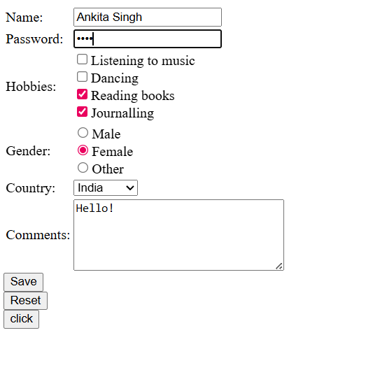
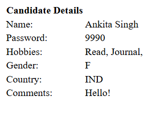

Project Title:
JSP Form Project.

Description:
This project is a basic HTML form developed using JSP (JavaServer Pages) that collects candidate information and displays the submitted data on another page.

Features:
Collect Candidate Details like:
Name,
Password,
Hobbies,
Gender,
Country,
Comments.

Displays submitted data dynamically using JSP.
Demonstrates form handling using request.getParameter() and request.getParameterValues().

Technologies Used:
HTML,
JSP,
Java(Servlet API),
Apache Tomcat (for deployment).

Screenshots:

 

How to Run the Project:

Install Apache Tomcat server

Place the project folder inside the webapps directory

Start the Tomcat server

Open your browser and go to:

http://localhost:8080/jsp-form-project/form.html

License:

This project is licensed under the MIT License.
